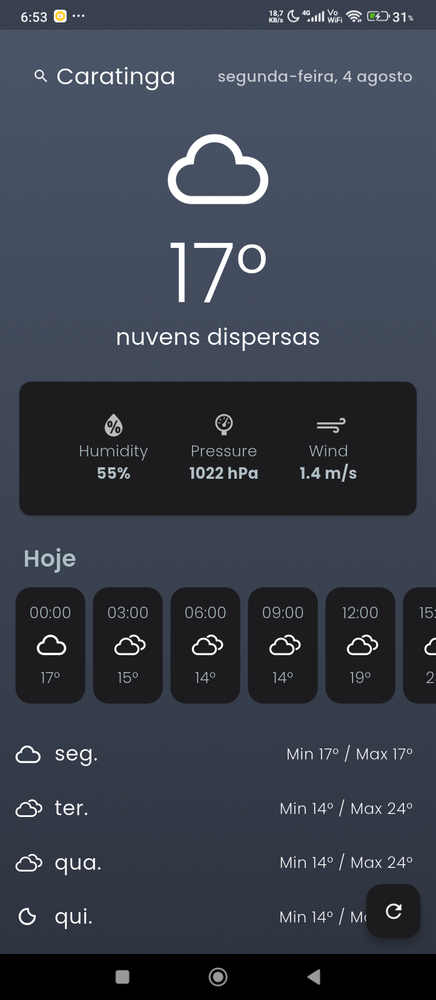
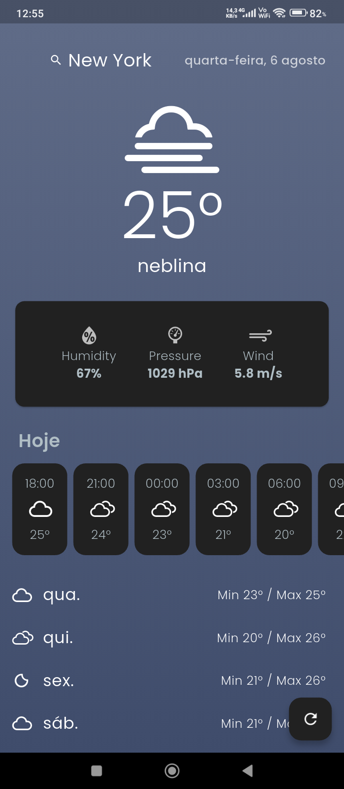
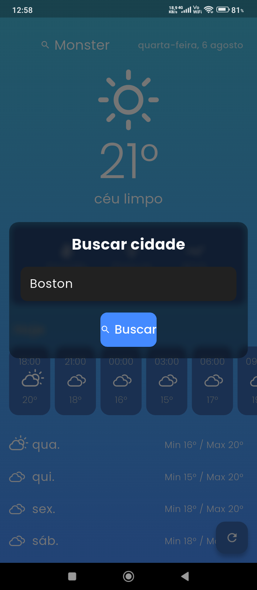

# 🌤️ Clima App 2

Aplicativo de previsão do tempo moderno, intuitivo e responsivo, desenvolvido com Flutter. Detecta automaticamente a localização do usuário (com permissão) e exibe dados climáticos em tempo real, incluindo previsão por hora e semanal. Também funciona offline, utilizando dados armazenados localmente.

---

## 📸 Demonstração Visual

| Tela Inicial | Previsão por Hora | Previsão Semanal | Busca por Cidade |
|--------------|-------------------|------------------|------------------|
|  |  |  |  |

---

## 📱 Funcionalidades

- 📍 Detecção automática da cidade via GPS
- 🔍 Busca manual por cidade com validação
- 🌡️ Exibição do clima atual com ícone animado e temperatura
- 📊 Detalhes como umidade, pressão e velocidade do vento
- ⏱️ Previsão por hora com ícones e temperatura
- 📅 Previsão semanal com ícones e temperaturas mín/max
- 📦 Modo offline com cache local
- 🎨 Interface com gradientes dinâmicos e animações suaves
- 🧊 Tela de busca com efeito de desfoque (glassmorphism)
- 💬 Frases curiosas e dicas durante o carregamento
- ⏳ Timeout com alerta de conexão após 40 segundos
- ❌ Tela de erro com botão de “Tentar novamente”

---

## 🛠️ Tecnologias Utilizadas

| Tecnologia           | Finalidade                            |
|----------------------|----------------------------------------|
| Flutter              | Framework principal                    |
| GetX                 | Gerenciamento de estado e rotas        |
| GetStorage           | Armazenamento local                    |
| Geolocator           | Acesso à localização do dispositivo    |
| Geocoding            | Conversão de coordenadas em cidade     |
| Dio                  | Requisições HTTP                       |
| Intl                 | Formatação de datas                    |
| Google Fonts         | Tipografia personalizada               |
| Weather Icons        | Ícones temáticos para clima            |
| Mocktail / Mockito   | Mocks para testes unitários            |
| Integration Test     | Testes de integração                   |

---

## 🧪 Testes Automatizados

- ✅ Testes unitários com `flutter_test`, `mocktail`, `mockito`
- 🧪 Testes de integração com `integration_test`
- 📊 Cobertura de código com `flutter test --coverage`

---

## 🚀 Como Gerar o APK

1. Certifique-se de que o Flutter está instalado e configurado.
2. No terminal, execute:

```bash
flutter build apk --release

- O APK será gerado em:
build/app/outputs/flutter-apk/app-release.apk

Você pode instalar esse APK diretamente em dispositivos Android.
👨‍💻 Autor
Desenvolvido por Emanoel da S. Gomes
📸 Créditos visuais: icons8
